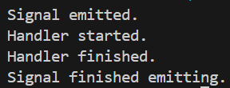
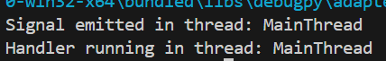
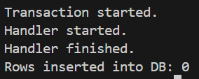
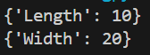

# Respository Name: AccuKnox-Django-Trainee-Assignment<br>

### Description: This repository contains the assignment given by AccuKnox for the Django Trainee position.<br>

### Date : 23 September 2024<br>

## Task 1: Django Signals

### Question 1<br>
By default are django signals executed synchronously or asynchronously? Please support your answer with a code snippet that conclusively proves your stance. The code does not need to be elegant and production ready, we just need to understand your logic.<br>

<strong>Ans </strong>: By default , Django signals are executed synchronously. When a signal is sent all helper functions are executed simultaneously and only after that does the control return to the caller. This can be proved by the following code snippet:<br>

#### Code:<br>

```python
import time
from django.dispatch import Signal

my_signal = Signal()

def helper(sender, **kwargs):
    print("Handler started.")
    time.sleep(5)  
    print("Handler finished.")

my_signal.connect(helper)

print("Signal emitted.")
my_signal.send(sender=None)
print("Signal finished emitting.")
```

#### Output :<br>


#### Explanation:<br>
In the above code snippet we are able to see that the signal is 
emitted and only finishes emitting after all the handlers have completed their execution. This proves the fact that Django signals are executed synchronously.


### Question 2: 
Do django signals run in the same thread as the caller? Please support your answer with a code snippet that conclusively proves your stance. The code does not need to be elegant and production ready, we just need to understand your logic.<br>

#### Code:<br>

```python
import threading
from django.dispatch import Signal

my_signal = Signal()

def runner(sender, **kwargs):
    print(f"Handler running in thread: {threading.current_thread().name}")

my_signal.connect(runner)

print(f"Signal emitted in thread: {threading.current_thread().name}")
my_signal.send(sender=None)
```

#### Output:<br>


#### Explanation:<br>
The output shows on which threads each of the processes where running on and we can see that both of them were running on the same thread namely the MainThread. This proves that Django signals run in the same thread as the caller.

### Question 3: 
By default do django signals run in the same database transaction as the caller? Please support your answer with a code snippet that conclusively proves your stance. The code does not need to be elegant and production ready, we just need to understand your logic.<br>

#### Code:<br>

```python
from django.db import transaction, connection
from django.dispatch import Signal
from myapp.models import MyModel

my_signal = Signal()

def my_handler(sender, **kwargs):
    print("Handler started.")
    MyModel.objects.create(name="Signal Instance")

my_signal.connect(my_handler)

try:
    with transaction.atomic():
        print("Transaction started.")
        my_signal.send(sender=None)
        raise Exception("Rolling back transaction")
except:
    pass

with connection.cursor() as cursor:
    cursor.execute("SELECT COUNT(*) FROM myapp_mymodel WHERE name = 'Signal Instance'")
    row = cursor.fetchone()
    print(f"Rows inserted into DB: {row[0]}")
```

#### Output:<br>


#### Explanation:<br>
In the above code snippet we are doing a transaction on the database and then rolling back the transaction. To prove whether the signal and the caller share the same transaction we just have to check if this rolling back was affected on the transaction where the signal is present. If it does then the signal and the caller share the same transaction. The output shows that the signal was rolled back along with the caller transaction. This proves that Django signals run in the same database transaction as the caller.

<hr>

## Task 2: Custom classes in Python<br>

Description: You are tasked with creating a Rectangle class with the following requirements:

An instance of the Rectangle class requires length:int and width:int to be initialized.
We can iterate over an instance of the Rectangle class <br>
When an instance of the Rectangle class is iterated over, we first get its length in the format: {'length': <VALUE_OF_LENGTH>} followed by the width {width: <VALUE_OF_WIDTH>}

#### Code :<br>
```python
class Rectangle:
    def __init__(self, length: int, width: int):
        self.length = length
        self.width = width
    
    def __iter__(self):
        yield {'Length': self.length}
        yield {'Width': self.width}


rect = Rectangle(10, 20)

for dimension in rect:
    print(dimension)
```

#### Output:<br>


<hr>
